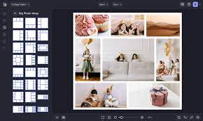

[[included-file-template-2]]
= PhotoCollage : An Overview

*Replace me:* This is a included file template #2 with a sample cross reference to xref:template-included-file-1.adoc[Included file template #1]. +

=== Introduction
Creating photo collage posters using your own digital photos is now easier with PhotoCollage. This powerful graphical tool uses and puts your submitted photographs together to generate a big poster, which you can customize according to your preferences. This document provides an overview of the product, its benefits and features, describes the target audience, and explains how to use it effectively.

=== Product Description +
PhotoCollage generates custom photo collages that look professional and visually appealing. +
It is programmed to arrange your photos and fill the entire poster. +
It generates random layouts that place photos occupying all the free space. +
This ensures that each photo is as large as possible. You can then change the final layout, dimensions, and border or swap photos in the generated grid, offering complete customization. You can save the final poster image in any size.

=== Target Audience +
Anyone can use PhotoCollage to create custom photo collage posters. +
They can use this tool to create photo albums, wall posters, marketing materials, and more. +
The user-friendly interface makes it easy for everyone, regardless of their technical knowledge or experience.

=== Benefits and Features +
PhotoCollage is an easy-to-use tool that can generate posters that look professional. +
The tool also offers a range of customization options and features that allow users to design collages that meet their individual preferences and needs. +
Additionally, this is a free and open-source tool. All users can access it without any financial or licensing restrictions.

=== How to Use the Product +
Using PhotoCollage is very easy!! +
[NOTE]
====
It is mandatory to have Python installed on the computer. 
====
 1. To start, the user needs to open the command prompt, navigate the correct directory and specify the selected photos they want to collage using the commands. +
 2. The tool generates random layouts that place photos making sure they fit and there is no free space. +
 3. After that, the user can freely select a layout to customize the final layout by manipulating the dimensions and borders or by simply swapping the photos in the generated grid.+
 4. The tool provides real-time previews of the collage as you make changes, allowing you to see how it will look before finalizing the design. +
 5. Once the collage is complete, the user can save the high-resolution image in any size.

=== Conclusion +
The tool provides a range of customization options and features that enable users to create collages and posters that meet their ideal preferences and needs. The user-friendly interface and real-time previews make it easy for users to generate collage posters faster and efficiently, helping them to accomplish their goals in a timely and efficient manner.

