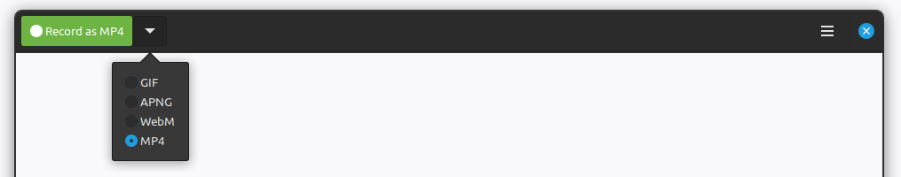
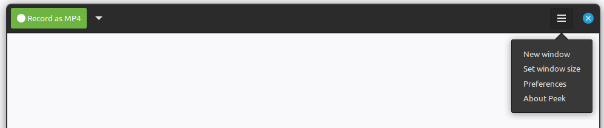
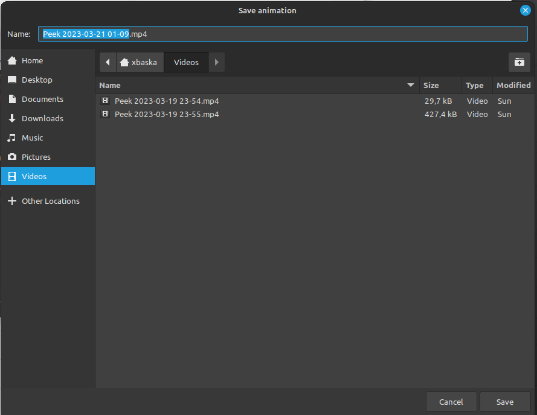

[[peek-making-a-recording]]
= Making a recording

*Go back:* If you don't know how to open Peek go to xref:running-peek[running peek].

Before starting to record:

== Prerequisites

* Move and resize Peek to fit the scope of the target of your recording
* Choose your video format in the drop down menu next to the *Record* button

.*Optionally:* you can edit additional *Preferences* settings, located in the burger menu button located in the top right of the Peek window.

== Procedure

. Click on *Record* and after a short delay the recording will start
. Perform the actions you wish to record
. Click on *Stop* when you are done recording 
. Choose your save directory in *Save animation* and *Save* your recording.

*Warning:* While the recording is ongoing you may not move or resize the Peek window.
