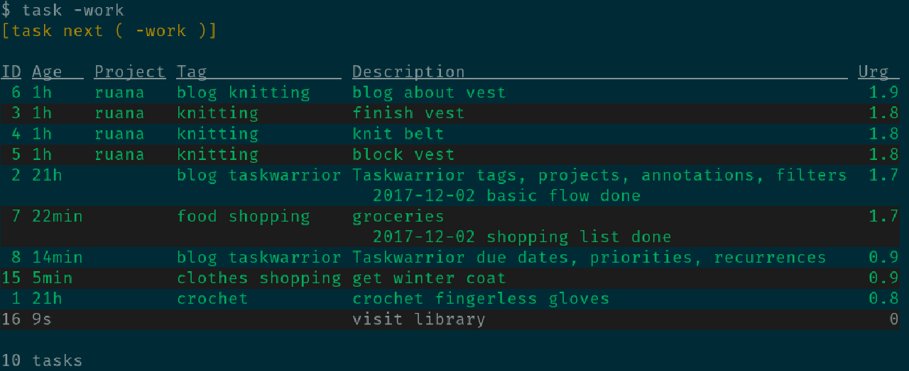
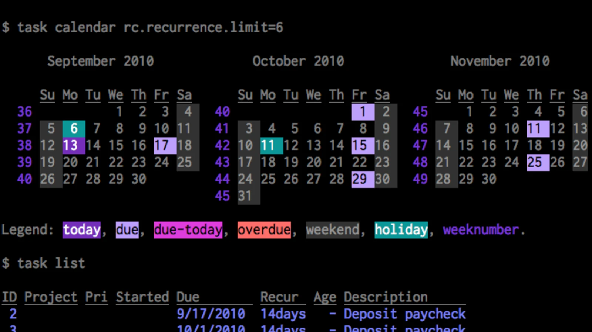

[[task-warrior-main]]
= Taskwarrior
Taskwarrior is a Free and Open Source TODO list manager in command line

== Introduction 

*Taskwarrior* is an open source software for task management. You can use it primarily by _Command Line Interface_ (CLI), but with an extensive library of extensions, you can also add a _Graphical User Interface_ (GUI).

With *Taskwarrior*, you can:

* manage your tasks
* set deadlines, priorities, tags
* filter through data

The main benefits are its _flexibility_ and _simplicity_ - you can use as little or as much of the features as you want without being overwhelmed by unnecessary features.

== Who is it for?

*Taskwarrior* is ideal for users that prefer _simple_ and _flexible_ task management tools with little to none distractions. It's perfect for those with slow computers or for those that simply don't like bloated software.

The software can be useful for users who value _privacy_ above all and want to synchronize their tasks on their own servers.

== Why do you need it?
If you want to stay productive and keep track of your tasks in a simple way, *Taskwarrior* is the perfect tool for you. With its minimalist CLI, there is basically no distraction that would stop you from being productive.

You can _customize_ your task management workflow as much as possible with extensions or by defining your own attributes for tasks. *Taskwarrior* supports all desktop platforms (Linux, Windows, MacOS), allowing you to synchronize your tasks on all of them.

[#installation]
== Installation 
To use *Taskwarrior*, you need to download it from the https://taskwarrior.org/download/[official website] or you can find it in your package manager.

Once installed, you can start managing your tasks using the command line.

== Usage
For detailed usage overview, head to the xref:taskwarrior-usage[usage page].

== Images of the CLI interaction

