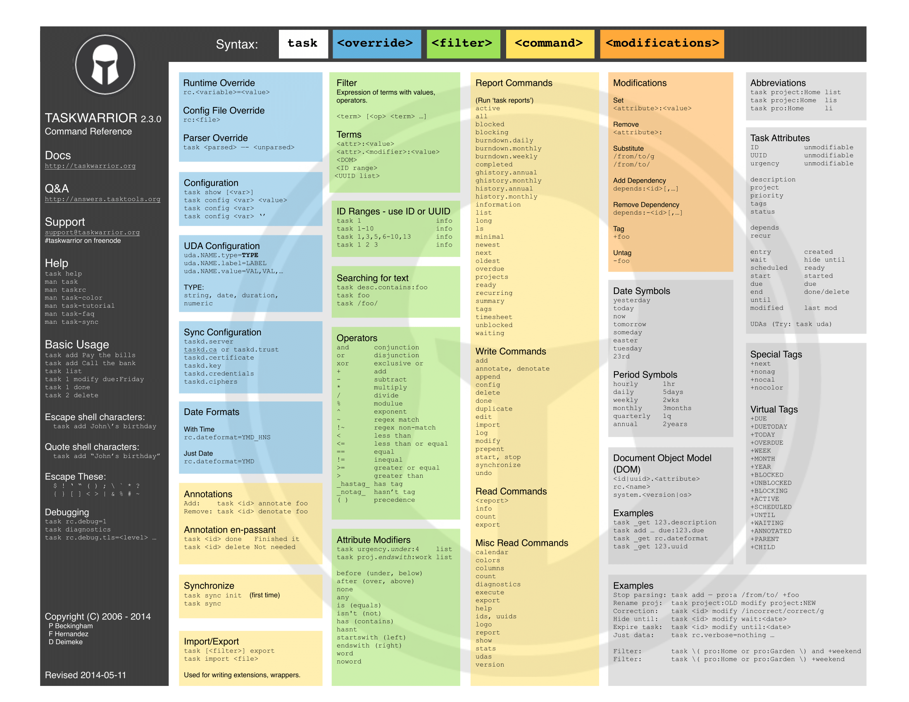

[[taskwarrior-usage]]
= Using Taskwarrior

To get started with using task warrior we will introduce the basic workflow. First let's add some tasks.

[source,shell, subs="quotes"]
----
$ task add Buy milk +
Created task 1.

$ task add Buy eggs +
Created task 2. +
----
Now let's see our TODO list

[source,shell, subs="quotes"]
----
$ task list

ID Description
--------------
1  Buy milk
2  Buy eggs

2 tasks.
----
Now let's complete a task

[source,shell, subs="quotes"]
----
$ task 1 done
$ task list

ID Description
-- -----------
1  Buy eggs

1 task.
----

With `list`, `add` and `done` commands you are able to use Taskwarrior as a very minimal and useful TODO list application, but if you want more we have hundreds of different commands and flags in our https://taskwarrior.org/docs/[docs] that can help you with setting up filters, custom reports, color coding and much more. To get the most out of Taskwarrior, our recommended reading would be our https://taskwarrior.org/docs/best-practices/[Best Practices].

For quick reference about the various commands you're able to execute, refer to out Cheat Sheet below.

