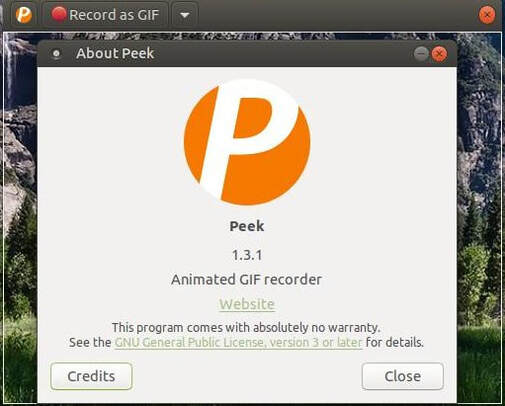

[[included-file-template-2]]
= Included file template #2

*Replace me:* This is a included file template #2 with a sample cross reference to xref:template-included-file-1.adoc[Included file template #1]. +

[[Title]]
=== Title: +
Peek: Your Ultimate Screen Recording Tool for Professional-Quality Instructional Videos

[[Introduction]]
=== Introduction: +
Peek is open-source software that enables users to record a part or the entire screen across multiple platforms. It is a useful tool for educators or instructors who need to create video content. 
The purpose of this documentation is to provide users with a comprehensive guide to utilizing Peek's features and functionalities.

[[installation]]
=== installation: +	
Peek has to be downloaded and installed on the device before being used.
Follow the below steps to finish the straightforward installation process: +
1. Download the software that is compatible with your operating system from the Peek website. +
2. Double-click the installation file to launch the installation procedure when the download is finished. +
3. To finish the installation procedure, adhere to the wizard's directions. +

For more information about the Recording procedure, kindly visit https://github.com/phw/peek[github.] +

image::https://play-lh.googleusercontent.com/PCpXdqvUWfCW1mXhH1Y_98yBpgsWxuTSTofy3NGMo9yBTATDyzVkqU580bfSln50bFU[github,300,200]

[[recording]]
=== Recording: +
After installation, users can begin recording their screen activity by following these steps: +
1. Start the Peek program. +
2. By clicking and dragging the mouse, choose the portion of the screen that you wish to capture. +
3. Change the recording's frame rate, duration, and audio input as necessary. +
4. To begin recording, use a hotkey or use the countdown timer. +
5. Once the recording is complete, preview it and export it in the preferred format, such as MP4, WebM, or GIF. +

[[features]]
=== features: +
Peek application offers several features that make it an ideal tool for creating instructional or tutorial videos. It includes + 
1. Recording audio and video concurrently: Peek enables users to record audio and video simultaneously, making it simpler to create professional instructional films. + 
2. Possibilities for customization: Peek gives customers a variety of ways to alter the recording settings so they may best meet their needs. +
3. Hotkey shortcuts: Peek has a number of hotkey shortcuts that make starting and stopping recordings quick and simple. + 
4. Peek has a countdown timer that allows users to get ready before beginning a recording.+

[[Verification]]
=== Verification: +
It is advised to check the output video file to make sure it satisfies the necessary criteria, including resolution, audio quality, and format compatibility, once the 
installation and recording are finished. Checking the recorded movies' storage location is also advised to prevent data loss and disk space problems.