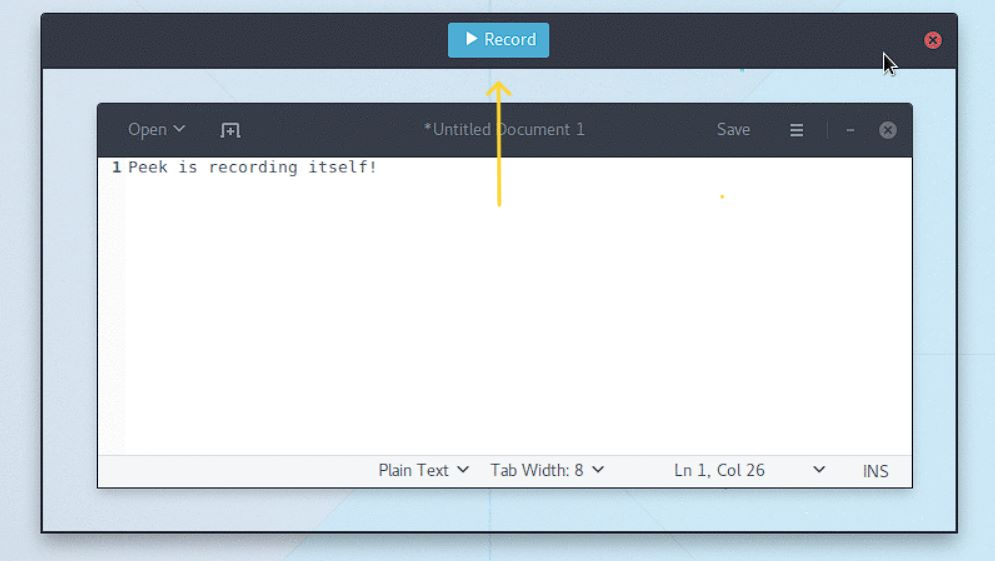
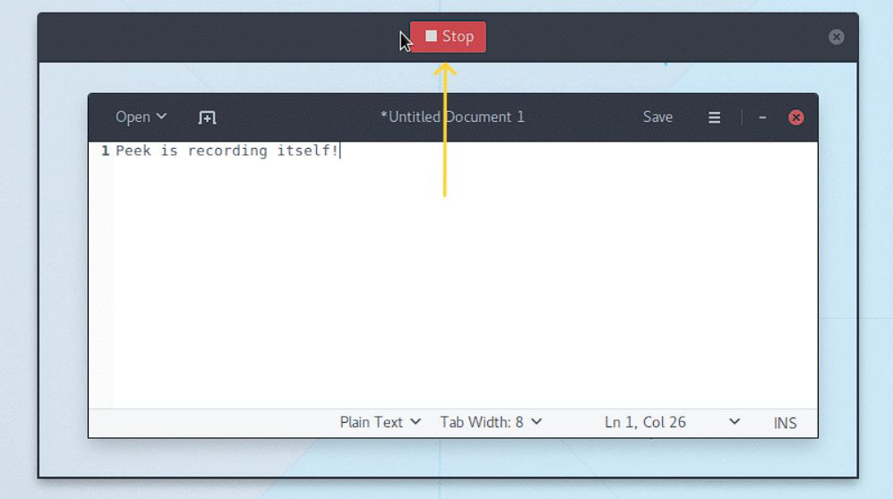

For installation procedures kindly follow the given link: xref:template-included-file-1.adoc[Introduction and Installation]. +

[[recording]]
=== Recording: +
After installation, users can begin recording their screen activity by following these steps: +
1. Start the Peek program. +
2. By clicking and dragging the mouse, choose the portion of the screen that you wish to capture. +
3. Change the recording's frame rate, duration, and audio input as necessary. +
4. To begin recording, use a hotkey or use the countdown timer. +
5. Once the recording is complete, preview it and export it in the preferred format, such as MP4, WebM, or GIF. +

Refer to the below screenshots from the peek application:-

[[features]]
=== features: +
Peek application offers several features that make it an ideal tool for creating instructional or tutorial videos. It includes + 
1. Recording audio and video concurrently: Peek enables users to record audio and video simultaneously, making it simpler to create professional instructional films. + 
2. Possibilities for customization: Peek gives customers a variety of ways to alter the recording settings so they may best meet their needs. +
3. Hotkey shortcuts: Peek has a number of hotkey shortcuts that make starting and stopping recordings quick and simple. + 
4. Peek has a countdown timer that allows users to get ready before beginning a recording.+

[[Verification]]
=== Verification: +
It is advised to check the output video file to make sure it satisfies the necessary criteria, including resolution, audio quality, and format compatibility, once the 
installation and recording are finished. Checking the recorded movies' storage location is also advised to prevent data loss and disk space problems.