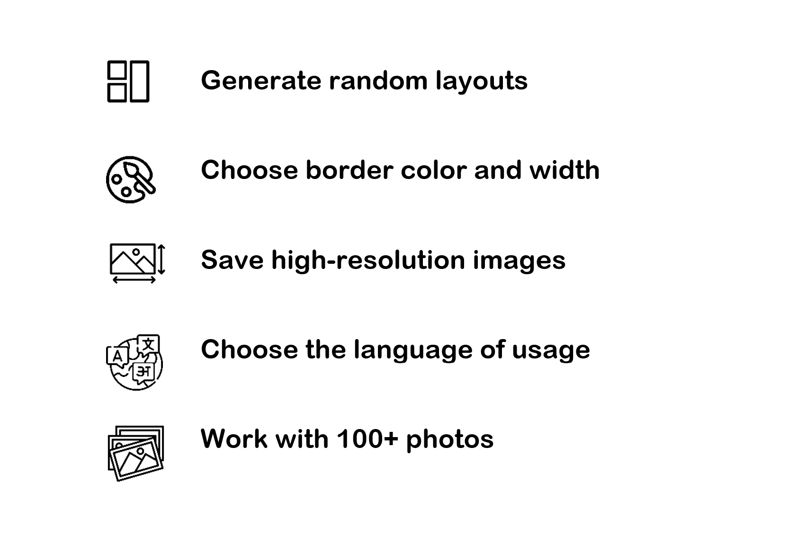

[[about_photoollage]]
= About PhotoCollage

*PhotoCollage* is a free, open-source software for creating photo collage posters. It allows its users to upload multiple photos and create a big poster that they can save in any size.

With *PhotoCollage* you can:

Refer to xref:using_photocollage.adoc#using_photocollage[use instructions of PhotoCollage] for more information.

