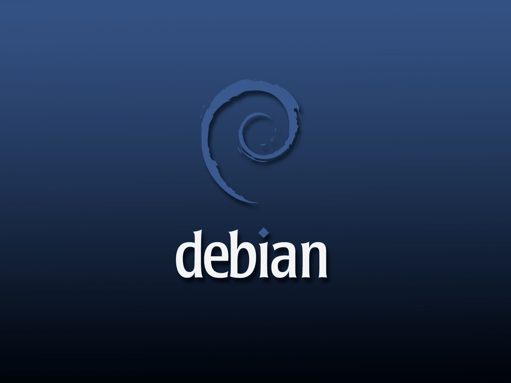
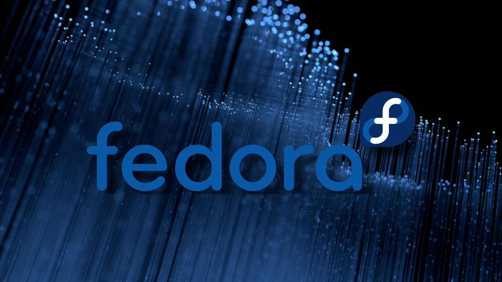
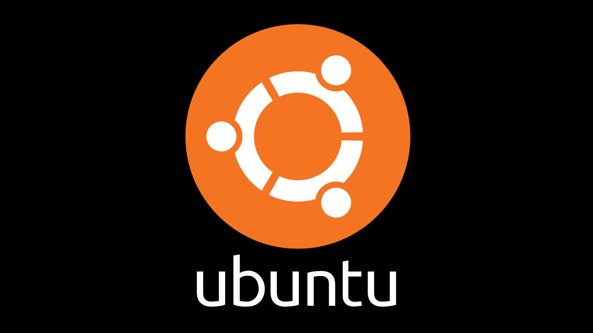
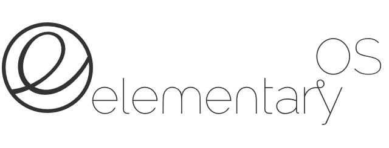

[[file-1]]
= file 1

== *3a. Describe the product: benefits, what it does.* +
**About Peek +
**Peek is useful for creating tutorials, bug reports, demonstrations and screen +
capture in general. It is easy to use and provides a simple and efficient way to +
share information with others. +
 +
**What it does +
**Users can select a specific region of their screen to record, adjust the frame rate +
and quality of the recording, and add annotations such as text or arrows. Once +
the recording is complete, the user can preview it before saving it as a GIF or +
video file. The recording can also be directly uploaded to various platforms like +
Imgur, Dropbox, etc. +
 +
*Benefits of Peek* +
● After recording, Peek allows users to easily share their recordings with +
others through various platforms like Imgur, Dropbox, and Gfycat. This +
makes it an efficient way to communicate ideas and information with +
others. +
● It allows users to quickly capture and share animated GIFs or videos of +
their screen without the need for complex settings or configurations. +
● Peek has a simple and intuitive interface, making it easy to use for both +
beginners and advanced users. +
● For people working from home or remotely, Peek is a helpful tool for +
capturing and sharing screen recordings with colleagues, clients, or team +
members who are not physically present. +
 +

=== *3b. Who uses the product?* +

*For whom Peek is intended for* +
● Software developers: Software developers can use Peek to create +
animated gifs or videos of their software applications to demonstrate new +
features, explain how to use the software, and report bugs. +
● Content creators: Content creators, YouTubers, can use Peek to capture +
short snippets of their screen to include in their content. +
● Educators: Tutors can use Peek to create short animated GIFs or videos +
to explain complex concepts, illustrate difficult problems, or provide visual +
aids for their students. +
 +

==== *3c. Why do users need it?* +


*Reasons for using Peek* +
● Providing visual content: Content creators can use Peek to capture short +
snippets of their screen to include in their content, providing a visual aid to +
their audience. +
● Creating tutorials: Peek allows users to easily record and share short +
animated gifs and videos of their screen, making it a useful tool for +
creating tutorials and how-to guides. +
● Collaborating remotely: People working from home or remotely can use +
Peek as a helpful tool for capturing and sharing screen recordings with +
colleagues, clients, or team members who are not physically present. +
 +

===== *3d. How to use the product?* +


*Prerequisites before installation* +

● GTK+ 3.20 +
● GLib 2.38 +
● https://github.com/kupferlauncher/keybinder[Libkeybinder3] +
● FFmpeg 3 +
● GStreamer 'Good' plugins (for recording on GNOME Shell) +
● https://gif.ski/[gifski] (optional but recommended for improved GIF quality) +

*Build system* +
● https://vala.dev/[Vala Compiler] +
● https://mesonbuild.com/[Meson] +
● https://www.gnu.org/software/gettext/[gettext] +
● https://github.com/mvertes/txt2man[txt2man] +

*Installation* +
Peek is available in package repositories of various Linus distributions: +

[#img-archlinux]
image::archlinux.jpg[archlinux,300,200]
----
sudo pacman -S peek
----
[#img-debian]

----
sudo apt install peek 
----
[#img-fedora]

----
sudo dnf install peek 
----
[#img-ubuntu]

----
sudo add-apt-repository ppa:peek-developers/stable
sudo apt update
sudo apt install peek
----
[#img-elementary]

----
sudo apt install software-properties-common
sudo add-apt-repository ppa:peek-developers/stable
sudo apt update
sudo apt install peek 
----
[#img-solus]

----
sudo eopkg it peek
----
[#img-flatpak]
image::flatpak.jpg[flatpak,300,200]
----
flatpak run com.uploadedlobster.peek
----
Update to the latest version of Peek
----
flatpak update --user com.uploadedlobster.peek
----

Build from source package +
you would need to install Peek using Meson with Ninja-build:
----
git clone https://github.com/phw/peek.git
cd peek
meson --prefix=/usr/local builddir
cd builddir
ninja-build

# Run directly from source
./src/peek

# Install system-wide
sudo ninja-build install
----

_Note:For some linux distribution `ninja-build` might be called `ninja`._

Please check the https://github.com/phw/peek#about[GitHub repository] for installation according to your Linux +
distribution. +
 +
 +
 +
**Launch Peek +
**Launch Peek from the applications menu or by typing ```peek``` in the terminal. +
 +
**Select the region to record +
**Use the mouse to select the area of the screen to record. You can choose to +
record the entire screen or a specific region. +
 +
**Adjust recording settings +
**Adjust the recording settings, such as the frame rate and quality of the recording +
before clicking on record. +
 +
**Start recording +
**Click the *Record* button to start recording. You will see a countdown before the +
recording starts. +
 +
**Stop recording +
**Click the *Stop* button to stop recording. +
 +
**Preview recording +
**You can preview the recording before saving it. +
 +
**Save or share the recording +
**You can save it as a GIF or video file. You can also directly upload the recording +
to various platforms like Imgur, Dropbox etc. +
 +

===== *3e. Do users accomplish their goal?* +

Users can accomplish their goal by adjusting the proper frame rate before +
recording the screen capture. With many people working remotely, Peek is an +
intuitive and efficient way to capture what are the outputs they are getting when +
developing some code. +
Educators can show their students how to solve tasks using Peek which can +
capture what the instructor is doing, with the students following the gifs or videos. +
Content creators can use Peek to showcase how their code works by showing +
their screen captures in videos. +

xref:file-2.adoc[Creating content with Peek] 

