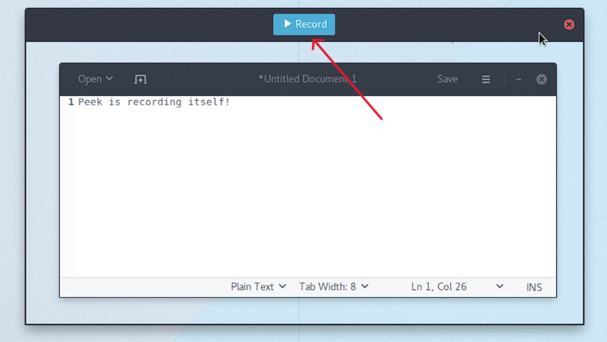
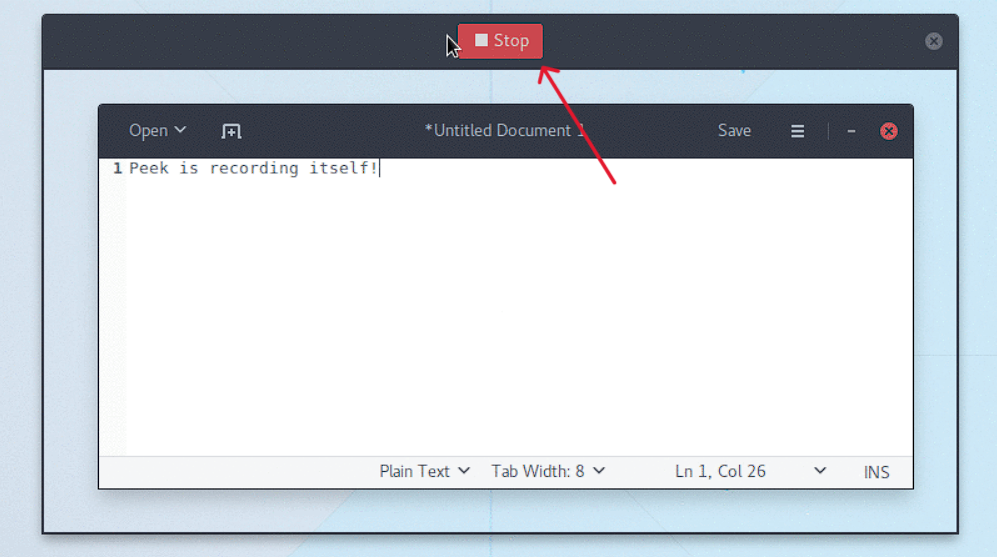

= Using Peek: A Step-by-Step Guide +
 

* Download and install Peek on your Linux system. +
You can also refer to the link _https://github.com/phw/peek#installation_ for more clarification. 

* Find Peek in your applications menu. +

* Drag your cursor to create a rectangle around the area you want to record on your screen. You can also record your entire screen by selecting the _"Full Screen"_ option. +

* Customize your recording options by adjusting the quality, frame rate, and visibility of the mouse cursor. +

* Start the screen recording by clicking the *"Record"* button.

 
* When you've completed your recording, click the *"Stop"* button. 

 

* If necessary, preview and edit your recording. +

* Save your screencast as an animated GIF, WebM, or MP4 video file. +

* You can share your screencast with others or keep it for yourself. +

That's the end of it! You can quickly and easily create short screencasts with Peek using these simple steps.

