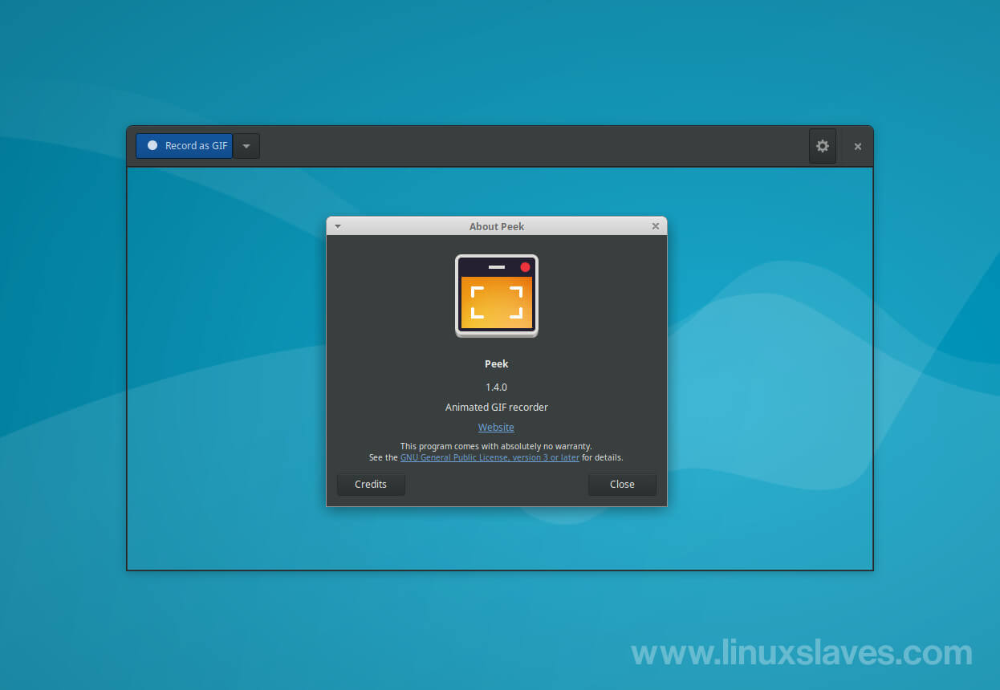

[[peekMain]]
= Peek
Peek is an animated GIF recorder available for Linux-based operating systems.

== Purpose 

*Peek* is a free and open-source software that allows users to create short recordings of their computer screens and export them as animated *GIFs*.

It is particularly useful for creating quick tutorials or demonstrations of software applications, as well as for creating animated memes or social media content.

The software allows users to quickly and easily capture their screens without having to deal with complex video editing software. It features a simple user interface with basic recording and editing tools. Additionally, because the output is in the form of an animated GIF, it is easy to share with others.

Overall, Peek is a useful tool for anyone looking to create simple screen recordings and animated GIFs.

[#installation]
== How to install?

*Peek* is available on different Linux distributions such as Arch Linux, Debian, Fedora, Gentoo and many more, in their official package repositories.

For details on how to install on your preferred distribution of Linux, see link:https://github.com/phw/peek#installation[Peek installation guide.]

== How to use it?
To learn how to use Peek, click 
xref:HowToUsePeek[*here*].

== How it looks like?

